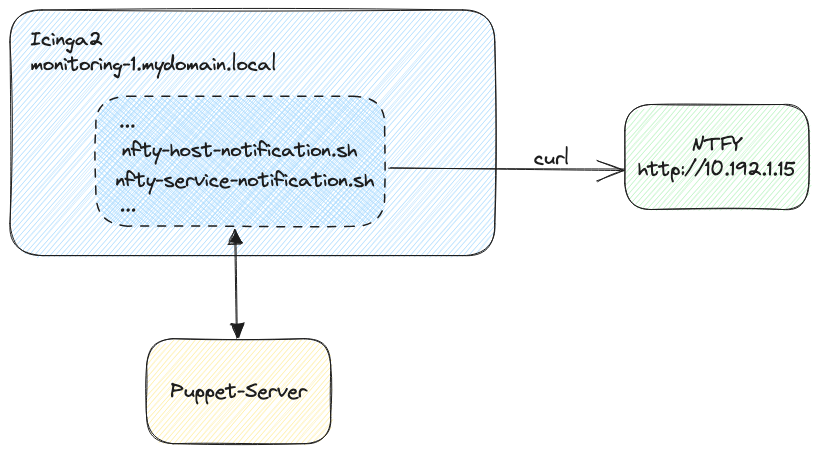

# puppet-icinga-ntfy

## Einleitung
Falls ein Server oder ein wichtiger Dienst ausfällt, ist es notwendig, dass die zuständigen Personen schnellstmöglich am Smartphone informiert werden. In diesem Beispiel verwenden wir Icinga2 für die Serverüberwachung und NTFY für die Benachrichtigung. Mithilfe von eigener Notification-Scripte, sollen die Benachrichtigungen von Icinga2 an NTFY übergeben. Um die Einrichtung dieses System zu automatisieren, wird Puppet verwendet.

## Dokumentation
Weitere Details befinden sich in der [Dokumentation](https://andrekloster.de/iac/puppet/icinga_ntfy/).
